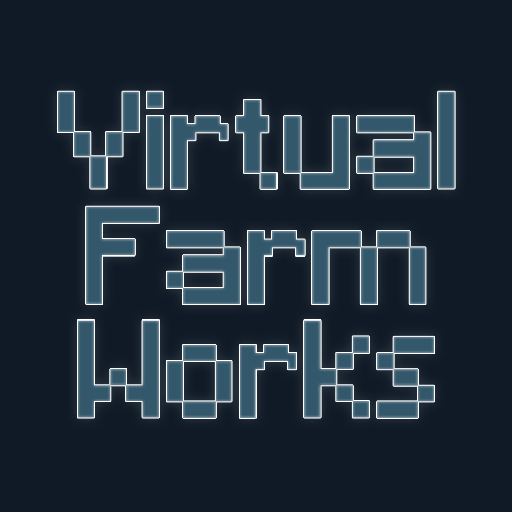
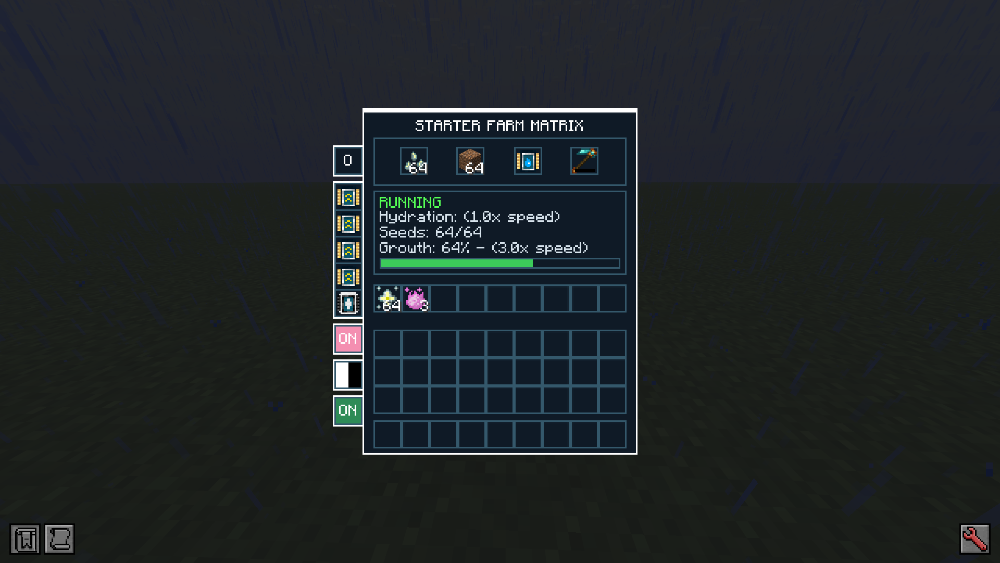
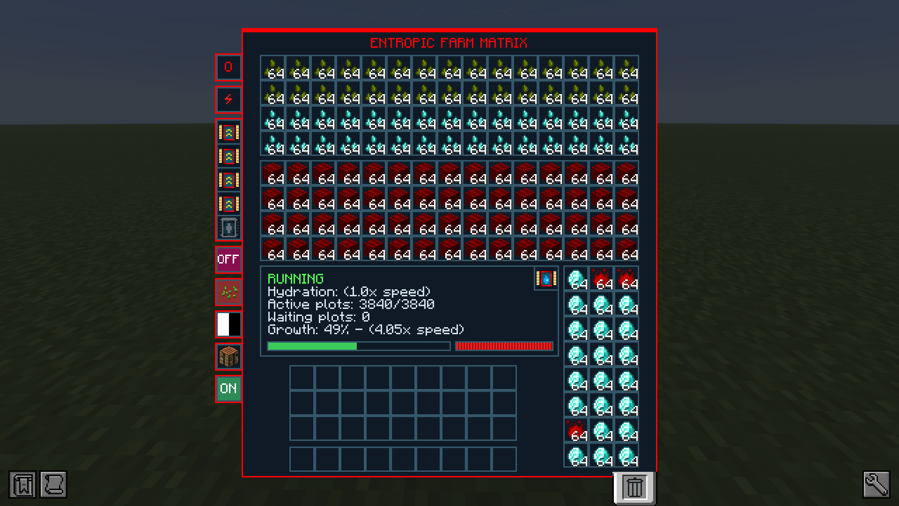
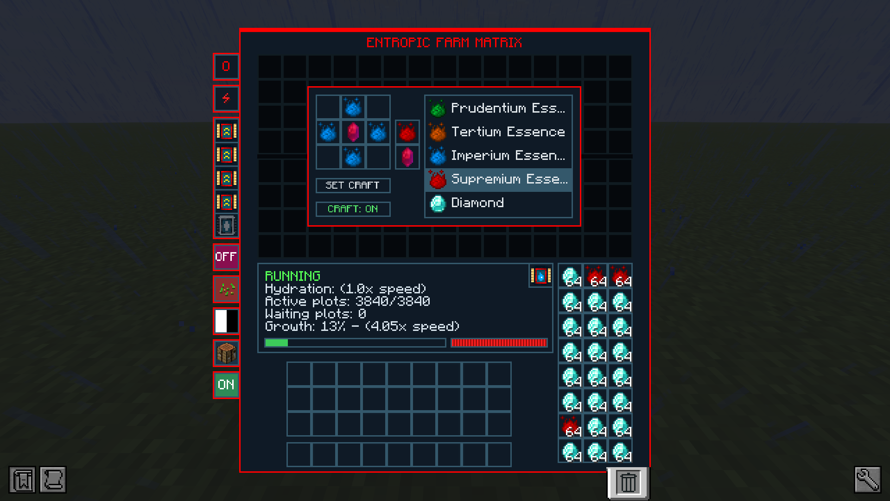

# Virtual Farm Works



**Compact, server-friendly virtual farming for NeoForge.** A Farm Matrix grows plants inside a single block: put seeds
and soils in, take the harvest out. Every machine runs one shared growth cycle instead of thousands of individual
crops: 3,840 plots, the maximum capacity of an Entropic Farm Matrix, cost the same as a single seed in a Starter
Farm Matrix, so even huge farms cost almost nothing in server tick time.

Made by **Redkeep** for Minecraft **26.1.2** and NeoForge.

## Machines (Starter and Entropic for now, new mid tiers coming)

### Starter Farm Matrix

An early-game farm for one kind of plant.

*   One seed slot and one soil slot: plots = the smaller of the two counts, up to 64.
*   Water Provider Upgrade slot: without water the machine grows at only 25% speed (by default).
*   Four Growth Speed Upgrade slots (+50% speed each, up to 3x by default).
*   Hoe slot: plants that need tilled soil (wheat on dirt) need a hoe; tilled soils (farmland) do not. Any hoe from any mod works.
*   Auto-export into adjacent inventories, per face.
*   Fertilized Essence switch (ON/OFF): with Mystical Agriculture installed, choose whether its crops also drop Fertilized Essence.
*   Harvest filter (whitelist or blacklist) to throw away the drops you do not want.
*   No power needed.



### Entropic Farm Matrix

The endgame farm: up to 3,840 plots in one block.

*   60 plant kinds in two 4x15 grids (plantables on top, soils below), each up to 64 plots. No hoe needed.
*   Powered by FE: 90 FE per active plot per tick by default. With too little FE it keeps running, only slower; at 0 FE it stops.
*   Six modes per face (click a face to cycle, hover it to read what the mode does):
    *   **NONE**: gives and takes nothing.
    *   **OUTPUT ONLY SEED PRODUCTION**: exports what the plants produced, not crafted items.
    *   **OUTPUT ONLY CRAFTED**: exports only what the autocrafter made.
    *   **OUTPUT ALL PRODUCED**: exports the harvest and the crafted items, never the seeds and soils in the grids.
    *   **INPUT SEEDS AND SOILS**: pipes and adjacent inventories fill the grids, pairing seeds with soils.
    *   **OUTPUT ONLY SEEDS AND SOILS**: gives back the seeds and soils planted in the grids, to pipes or a chest placed against that face. Handy to empty a machine or move its plants to another one.
*   Replant: when it is on and a plant drops new seeds, those seeds plant themselves in the machine's free soils (when there are more soils than seeds).
*   Built-in autocrafter: up to 100 crafting recipes, set by hand or with JEI's "+" button. Harvests are crafted as they come out, recipes chain (essence -> ingots -> blocks), and the machine also crafts from what its output holds. A catalyst slot takes Mystical Agriculture's Master Infusion Crystal, so higher essence tiers craft automatically. The recipes stay on the machine item when you break it.
*   The same upgrades as the Starter.





## Plants

Anything that can be planted: crops, saplings (the machine grows the tree and harvests it), flowers, grass, mushrooms,
nether fungi, aquatic and hanging plants, and modded plantables. Which soil a plant accepts comes from the game's own
rules, so modded plants and soils work without special support. Plants with no harvest of their own (flowers, grass)
give 10 of themselves per plot.

Plots added in the middle of a cycle wait for the next one, so you cannot top up a farm just before the harvest.

## Upgrades

| Upgrade | Effect |
|---|---|
| Water Provider Upgrade | Full speed (without it: 25%) |
| Growth Speed Upgrade | +50% growth speed, up to 4 per machine |
| Crux Provider Upgrade | Provides the crux any Mystical Agriculture seed needs |

Water Provider and Growth Speed Upgrades come in tiers. An upgrade fits machines of its own tier or below: Starter
upgrades fit the Starter, Entropic upgrades fit both machines.

## Recipes

Grid cells 1-9, left to right, top to bottom (JEI shows them all).

| Item | Recipe |
|---|---|
| Starter Farm Matrix | 1, 9 diamond; 2, 4, 6, 8 wheat seeds; 3, 7 redstone; 5 iron block |
| Starter Water Provider Upgrade | Corners diamond, sides iron ingot, center water bucket |
| Starter Growth Speed Upgrade | Corners redstone, sides diamond, center redstone block |
| Crux Provider Upgrade | Netherite blocks around a nether star |
| Entropic Farm Matrix | 1, 9 netherite ingot; 3, 7 diamond; 2, 4, 6, 8 redstone; 5 Starter Farm Matrix |
| Entropic Water Provider Upgrade | Corners diamond, sides iron ingot, center Starter Water Provider Upgrade |
| Entropic Growth Speed Upgrade | Corners redstone block, sides diamond, center Starter Growth Speed Upgrade |

## Mod support (all optional)

- **Mystical Agriculture** (9.0.9+): essence yields from Mystical Agriculture's own formula, cruxes, its farmland
  bonuses, a Fertilized Essence switch on every machine, and the Master Infusion Crystal as the autocrafter catalyst.
- **JEI** (29.34.0.90+): the "+" button fills the Entropic's autocrafter; items drag and drop onto the harvest filter
  and the crafting grid.
- **Jade** (26.1.10+): status, water, plots, growth and FE when you look at a machine.

## Performance

The whole point of the mod. Measured with the built-in load benchmark on a desktop PC (numbers vary with hardware):

| Situation | Cost per machine per server tick |
|---|---|
| Starter growing | 0.011 µs |
| Starter, 64 wheat plots at 3x, harvests included | 0.30 µs (1,000 such machines: 0.6% of a tick) |
| Entropic growing, 3,840 plots | 0.031 µs |
| Entropic, 3,840 wheat plots at 3x, harvests included | 4.8 µs |

A growing machine costs the same with 1 plot or 3,840: plots are counters, not objects. Machines never tick plants
one by one, never load chunks and do nothing while their chunk is unloaded.

## For server owners and pack makers

Everything below is in the server config `virtualfarmworks-server.toml` and applies without a restart. Modpacks are welcome, no need to ask.

**Per machine (Starter and Entropic separately)**

*   `growthTicks`: length of one growth cycle at 1.0x speed (default 600 = 30 seconds).
*   `noWaterSpeedMultiplier`: speed without a Water Provider (default 0.25).
*   `productionMultiplier`: yield multiplier for that machine (default 1.0).
*   `internalBufferSlots`: hidden output slots behind the visible ones (Starter 27, Entropic 72).
*   `seedBlacklist` / `soilBlacklist`: seeds and soils that machine refuses.

**Entropic only**

*   `seedsPerSlot` / `soilsPerSlot`: items each grid slot holds (default 64; capacity = 60 x the smaller one).
*   `energyPerPlot`: FE per active plot per tick (default 90; the FE buffer follows).
*   `replant`: allows the replant button (default on).
*   `crafterRecipes`: recipes the autocrafter holds (default and maximum 100).
*   `crafterBufferLimit`: items of one kind the autocrafter keeps while waiting for the rest of a recipe (default 1024).

**Everything else**

*   Growth Speed Upgrades: `bonusPerUpgrade` (default +50%) and `upgradesPerSlot` (default 1).
*   Hoe: `requireHoe` (default on), `consumeDurability` (default off) and `wearIntervalTicks` (default 1200 = 1 durability per minute).
*   Output: `autoExportIntervalTicks`, ticks between auto-exports (default 20; 0 = never).
*   Drops: `productionMultiplier` (global yield, default 1.0), `secondaryDropMultiplier` (extra seeds and by-products, default 1.0) and `otherPlantYield` (items per plot for flowers, grass and other plants without their own harvest, default 10).
*   Mystical Agriculture: `secondarySeedChanceMultiplier` (default 1.0) and `requiresEffectiveFarmland` (seeds only grow on their tier's farmland, default off).
*   Performance: `maxLootRollsPerHarvest` (default 64) and `maxTreesGrownPerHarvest` (default 4).
*   Global `seedBlacklist` / `soilBlacklist`. Blacklist entries can be an item (`mysticalagriculture:diamond_seeds`), a whole mod (`mysticalagriculture:*`) or an item tag (`#c:seeds`).

Datapacks can also change the tags (universal soils, mushroom and glow berry soils, autocrafter catalysts) and the data maps (soil speed bonuses, fixed yields).

## Requirements and download

- Minecraft 26.1.2 and NeoForge 26.1.2.109 or newer, on the client and on the server.
- Download: [GitHub Releases](https://github.com/redkeepp/virtual-farm-works/releases). CurseForge and Modrinth pages
  are coming.

## Bugs and ideas

Open an [issue](https://github.com/redkeepp/virtual-farm-works/issues) with the mod, Minecraft and NeoForge versions
and your `logs/latest.log` (or the crash report). The issue form asks for everything needed.

## Building from source

Requires JDK 25.

```
./gradlew build
```

The jar lands in `build/libs/` (`virtualfarmworks-<Minecraft version>-<mod version>.jar`). `./gradlew runClient` starts a
development client; `./gradlew runGameTestServer` runs the game tests. Design notes and specs are in `docs/`.

## License

MIT, for both code and assets (textures, models, JSON): use, change and share everything, even commercially; just
keep the license notice. Modpacks are welcome, no need to ask. See [LICENSE](LICENSE). Build files derived from the NeoForge
MDK keep their original notice in [TEMPLATE_LICENSE.txt](TEMPLATE_LICENSE.txt).
